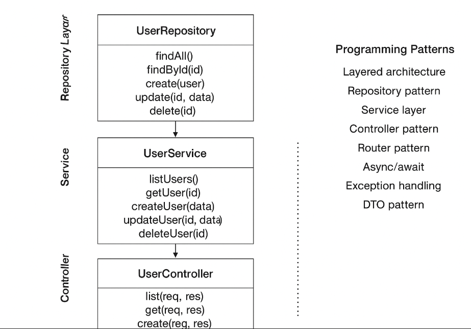

# nodejs
Building Projects with Nodejs

## Key Features

- Layered Architecture / 3-Layer Pattern
- All repository/service/controller methods use async/await
- Full CRUD API for users
- Error handling in controllers
- Ready for ES Modules, Node.js 18+
- Can use ESBuild for production bundle
- Can use TypeScript with type-only imports

# Project Architecture

  

| Pattern | Where | Purpose |
|---------|-------|---------|
| Layered Architecture | All layers	| Separates concerns
| Repository Pattern |	repositories/	| Abstracts data access
| Service Layer Pattern |	services/	| Centralizes business logic
| Controller Pattern |	controllers/	| Handles HTTP requests
| Router / Delegation |	routes/	| Delegates endpoints to controllers
| Async / Await |	services & repositories	| Non-blocking I/O
| Exception Handling |	Controllers	| Maps errors to HTTP responses
| Dependency Injection (manual) |	Controllers → Services → Repos	| Decouples components
| DTO / Data Flow |	Request/Response	| Encapsulates data transfer

| Data Access Layer |
|-------------------|
| Repository Layer
| src/repositories/user.repository.js / .ts
| Responsibility: Handles data storage, whether in-memory or database.
| Pattern: Repository Pattern — abstracts database operations behind a class interface.

| Business Logic Layer |
|----------------------|
| Service Layer
| src/services/user.service.js / .ts
| Responsibility: Implements business logic and orchestrates repository calls.
| Pattern: Service Layer Pattern — separates logic from controllers and DB access.

| Presentation / API Layer |
|--------------------------|
| Controller Layer
| src/controllers/user.controller.js / .ts
| Responsibility: Handles HTTP requests and responses, calls services.
| Pattern: Controller Pattern — decouples routing from business logic.

# Project Patterns

- Router Pattern / Modular Routing
- Singleton-ish Service Instances
- Error Handling / Exception Pattern
- Async/Await / Promise Handling
- Dependency Injection (light)
- DTO-ish Pattern (Data Transfer)

# Project from folder 1: Nodejs + JavaScript

````
npm init -y
npm i -D eslint prettier eslint-config-prettier eslint-plugin-prettier
npx eslint --init
npm i -D esbuild

npm i -S express
npm i -D nodemon

✔ What do you want to lint? · javascript
✔ How would you like to use ESLint? · problems
✔ What type of modules does your project use? · esm
✔ Which framework does your project use? · none
✔ Does your project use TypeScript? · No
✔ Where does your code run? · browser

````

# Project from folder 3: Nodejs + TypeScript

````
npm init -y
npm i -D typescript
npx tsc --init

npm i -S express

npm i -D \
  eslint \
  prettier \
  eslint-config-prettier \
  eslint-plugin-prettier \
  @typescript-eslint/eslint-plugin \
  @typescript-eslint/parser \

npm i -D @types/express
npm i -D nodemon
npm i -D @types/node
npm i -D ts-node typescript
npm i -D typescript-eslint

npm i -S cors body-parser uuid axios socket.io jsonwebtoken bcrypt better-sqlite3

````